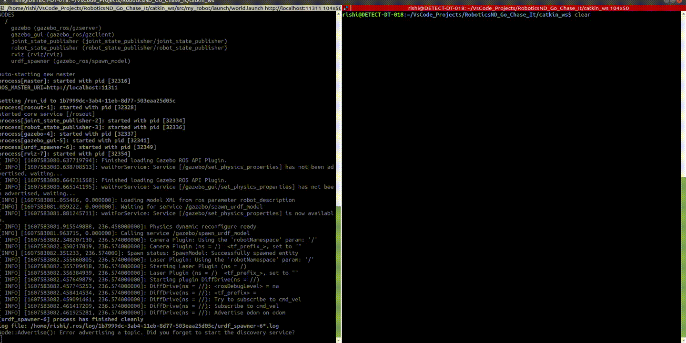
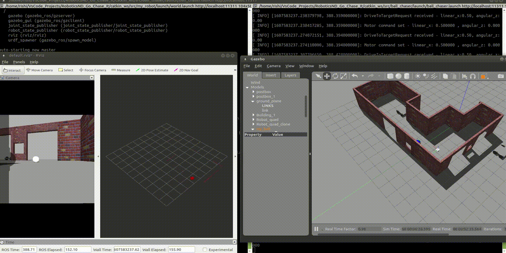
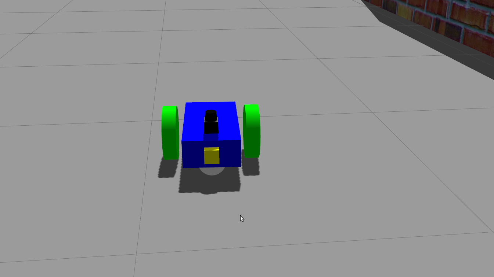
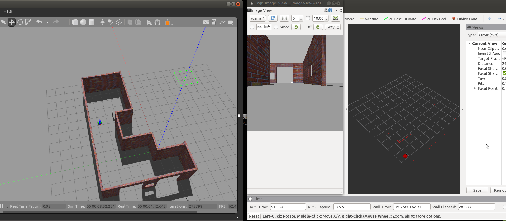
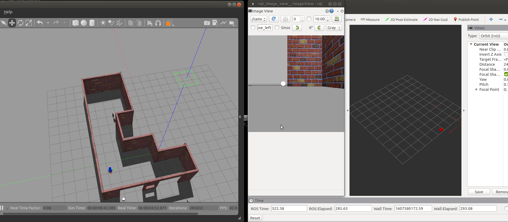
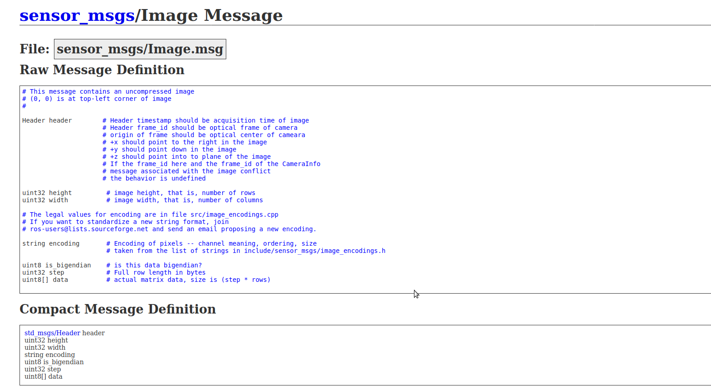
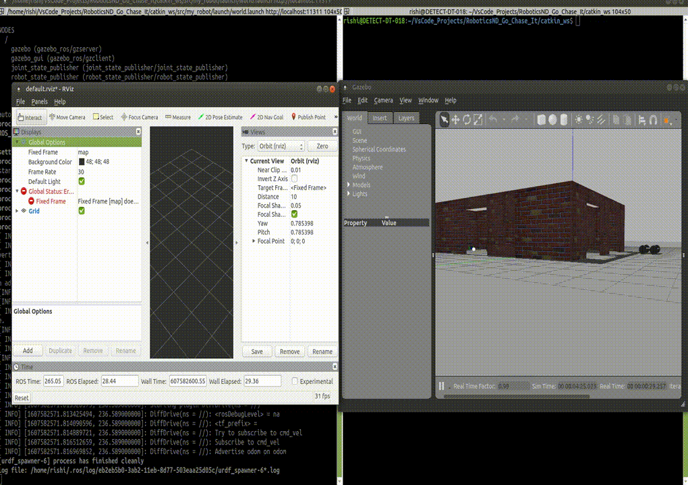

# Go Chase It
Project Description

## Final output/result
 
Robot follows the white ball


Robot follows the white ball when moved to a new location , first out of camera vision and then as brought back inside the vision of the robot, it tracks and follows back


* extreme left is the camera view from the robot front camera, center Rviz video shows the Lidar point cloud in realtime with red dots(white ball can be observed in the lidar point cloud as one to two dots separately when observed closely). Right side is the gazebo world which is being simulated with ROS framework consisting nodes(pub-sub & server-client),topics,messages,services, world , model and their respective launch files.


Summary of Tasks

In this project, two ROS packages were created inside catkin_ws/src: the drive_bot and the ball_chaser. Here are the steps followed  to design the robot, house it inside a world that you was modelled in gazebo, and programmed it to chase white-colored ball:

* drive_bot:
	* Created my_robot ROS package using `catkin_create_pkg my_robot` to hold the robot, the white ball, and the world. It is a differential drive robot  which is defined by a  `.xacro` file which follows Unified Robot Description Format. Two sensors have been added to the robot: a lidar and a camera. Add Gazebo plugins for your robot’s differential drive, lidar, and camera. 

    * House your robot inside the world you built in the Build My World project.Add a white-colored ball to your Gazebo world and save a new copy of this world.The world.launch file should launch your world with the white-colored ball and your robot.

* ball_chaser:
		Created a ball_chaser ROS package to hold  C++ nodes.
		Write a drive_bot C++ node that will provide a ball_chaser/command_robot service to drive the robot by controlling its linear x and angular z velocities. The service should publish to the wheel joints and return back the requested velocities. Write a process_image C++ node that reads your robot’s camera image, analyzes it to determine the presence and position of a white ball. If a white ball exists in the image, your node should request a service via a client to drive the robot towards it.The ball_chaser.launch should run both the drive_bot and the process_image nodes.

The robot designed in this project is a base model for all the other  projects that i have done as a part of  my Robotics Software Engineer Nanodegree Program.

## Robot with sensors placed (Black Lidar and Yellow Camera)

### Lidar Model ported from gazebo online repo: Hokuyo lidar


  * 1- Now, download this hokuyo.dae file and place it under the meshes directory you just created under my_robot.
  * 2- Add the Hokuyo sensor to my_robot.xacro under urdf subdirectory.


## Evaluation
 

 The directory structure and contain all the files listed here:
	
  
	catkin_ws                # Go Chase It Project
	 ├── src
	 │  ├── my_robot            # my_robot package                   
	 │  │   ├── launch   #folder for launch files   
	 │  │   │   ├── robot_description.launch
	 │  │   │   ├── world.launch
	 │  │   ├── meshes    # meshes folder for sensors
	 │  │   │   ├── hokuyo.dae
	 │  │   ├── my_ball   #folder for white ball model
	 │  │   │   ├── model.config
	 │  │   │   ├── model.sdf
	 │  │   ├── urdf     # urdf folder for xarco files
	 │  │   │   ├── my_robot.gazebo
	 │  │   │   ├── my_robot.xacro
	 │  │   ├── world  # world folder for world files
	 │  │   │   ├── myWorld_1
	 │  │   ├── CMakeLists.txt   # compiler instructions
	 │  │   ├── package.xml      # package info
	 │  ├── ball_chaser    # ball_chaser package                   
	 │  │   ├── launch     #folder for launch files   
	 │  │   │   ├── ball_chaser.launch
	 │  │   ├── src    # source folder for C++ scripts
	 │  │   │   ├── drive_bot.cpp
	 │  │   │   ├── process_images.cpp
	 │  │   ├── srv   # folder for ROS services
	 │  │   │   ├── DriveToTarget.srv
	 │  │   ├── CMakeLists.txt    # compiler instructions
	 │  │   ├── package.xml     # package info                  
	 ├── images       # results screen shots and gifs
	 │  
	 
	  
## Concepts and Classes
Concepts explored in this project:

  - Gazebo model and world-building
  - Gazebo plugins
  - URDF
  - ROS nodes , topics, messages publishers & subscribers framework,service  & client framework in C++.


## Getting Started
To view this project, you must have Gazebo and ROS installed on Linux. I have used ROS Melodic and Gazebo came along that installation, as i am using Ubuntu 18.04(bionic).

[Click here for Gazebo download and installation instructions](http://gazebosim.org).

[Click here for ROS installation instructions](http://wiki.ros.org/ROS/Installation).

With Gazebo and ROS installed, you first need to create a catkin workspace. Navigate to your home directory and execute:
```
$ mkdir -p catkin_ws/src
$ cd catkin_ws/src
$ catkin_init_workspace
```   
	 
	 
## Contents
There are 2 packages:<br>
* **ball_chaser** is for detection of a white ball, and motion planning.
* **my_robot** contains gazebo environemnts for the robot.

Note that some example snapshots of the robot simulator can be found inside the folder **images/**.

## Usage 

#### Step 1 

launch gazebo and Rviz simulator simultaneously. 
```
$ roslaunch my_robot world.launch
```
#### Step 2

Launch the ball following nodes/service.

```
$ roslaunch ball_chaser ball_chaser.launch
```


#### detect white ball and start chasing


#### chase in acion ( move ball further away to other position)


## Writing a service file DriveToTarget.srv file

Create a DriveToTarget.srv file under the srv directory of ball_chaser. Then, define the DriveToTarget.srv file as follows:

Request:

	linear_x type float64
	angular_z type float64

Response:

	msg_feedback type string


## Functioning of the drive_bot node and process_image node both written in C++ 
* drive_bot:
drive_bot.cpp server node that will provide the ball_chaser/command_robot service. Create the script under the src directory of your ball_chaser package. It might be a bit challenging to write this script from scratch, thus I am providing you with some hints.

Attached below is a program that will continuously publish to the robot /cmd_vel topic. This code will drive your robot forward:


```c++

#include "ros/ros.h"
#include "geometry_msgs/Twist.h"
//TODO: Include the ball_chaser "DriveToTarget" header file
#include "ball_chaser/DriveToTarget.h"

// ROS::Publisher motor commands;
ros::Publisher motor_command_publisher;

// TODO: Create a handle_drive_request callback function that executes whenever a drive_bot service is requested
// This function should publish the requested linear x and angular velocities to the robot wheel joints
// After publishing the requested velocities, a message feedback should be returned with the requested wheel velocities
bool handle_drive_request(ball_chaser::DriveToTarget::Request& req, ball_chaser::DriveToTarget::Response& res)
{
    ROS_INFO("DriveToTargetRequest received - linear_x:%1.2f, angular_z:%1.2f", (float)req.linear_x, (float)req.angular_z);
    
    // Pusblish motor command request
    geometry_msgs::Twist motor_command;

    motor_command.linear.x = req.linear_x;
    motor_command.angular.z = req.angular_z;

    motor_command_publisher.publish(motor_command);

    // Return a response message
    res.msg_feedback = "Motor command received and set- linear_x: " + std::to_string(req.linear_x) + " , angular_z: " + std::to_string(req.angular_z);
    ROS_INFO_STREAM(res.msg_feedback);

    return true;
}

int main(int argc, char** argv)
{
    // Initialize a ROS node
    ros::init(argc, argv, "drive_bot");

    // Create a ROS NodeHandle object
    ros::NodeHandle n;

    // Inform ROS master that we will be publishing a message of type geometry_msgs::Twist on the robot actuation topic with a publishing queue size of 10
    motor_command_publisher = n.advertise<geometry_msgs::Twist>("/cmd_vel", 10);

    ros::ServiceServer service = n.advertiseService("/ball_chaser/command_robot", handle_drive_request);
    ROS_INFO("Ready to send drive commands");

    // TODO: Define a drive /ball_chaser/command_robot service with a handle_drive_request callback function handle_drive_request

    
    // TODO: Handle ROS communication events
    ros::spin();

    return 0;
}

```
* process_image:
This node will analyze the image and request services to drive the robot. Create the source code file within the src directory of your ball_chaser package. It might be a bit challenging to write this program from scratch, thus I am providing you with some hints. Attached below is a piece of the complete code with multiple hints to help you finish the implementation. Below image explains the for loop that is used to iterate through each pixel of the image and if a white pixel is found depending where it is found as image step, drive bot is called with different angular velocity to run straight, right or left depending on the position of the robot. Where image message is of format provided below




```c++

#include "ros/ros.h"
#include "ball_chaser/DriveToTarget.h"
#include <sensor_msgs/Image.h>

// Defining a client node that will request the service published by the drive_bot node
ros::ServiceClient Client;

// This function calls the  service command_robot in order to drive the robot towards the given direction
void driving_robot(float linear_x, float angular_z)
{
    // TODO: Request a service and pass the velocities to it to drive the robot
    ball_chaser::DriveToTarget srv;
    srv.request.linear_x = (float)linear_x;
    srv.request.angular_z = (float)angular_z;

    // Calling the service command_robot and further passing  the requested commands to motor to drive
    if (!Client.call(srv))
        ROS_ERROR("Failed to call the command_robot service ");
}

// This callback function executes in a loop and reads the image data each time the service is queried
void processimage_callback(const sensor_msgs::Image image)
{

    int pixel_in_white = 255;
    bool ball_found = false;
    int column_id = 0;
    

    // TODO: Loop through each pixel in the image and check if there's a bright white one
    // Then, identify if this pixel falls in the left, mid, or right side of the image
    // Depending on the white ball position, call the drive_bot function and pass velocities to it
    // Request a stop when there's no white ball seen by the camera
    for (int i=0; i < image.height * image.step; i += 3)
    {   
        red = image.data[i];
        green = image.data[i+1];
        blue = image.data[i+2];

        if ((red == pixel_in_white) && (green == pixel_in_white) && (blue == pixel_in_white))
        {
            column_id = i % image.step;
            // Note x towards left side is positive and right is negative
            if (column_id < image.step/3)
            //the robot will drive towards left as column lies in the first step 
                driving_robot(0.5, 1);
            else if (column_id < ((image.step * 2)/3))
            //the robot will drive straight as column lies in the center step 
                driving_robot(0.5, 0); 
            else
            //the robot will drive right as column lies in the third step 
                driving_robot(0.5, -1);
            ball_found = true;
            break;
         }
     }

     if (ball_found == false)
         driving_robot(0, 0);        
}

int main(int argc, char** argv)
{
    // Initializing the client node : process_image and creating  a handle for ros master and other nodes to interact with it  
    ros::init(argc, argv, "process_image");
    ros::NodeHandle n;

    // Define a client service that is capable of requesting services using command_robot key word
    client = n.serviceClient<ball_chaser::DriveToTarget>("/ball_chaser/command_robot");

    // Subscribing to the topic /camera/rgb/image_raw to extract the image raw pixels inside the processimage_callback
    ros::Subscriber sub1 = n.subscribe("/camera/rgb/image_raw", 10, processimage_callback);

    // Handle ROS communication events
    ros::spin();

    return 0;
}

```


##  Topics to which Lidar and Camera will publish:
This is mentioned in `my_robot.gazebo`

* For the wheel joints, it's the cmd_vel topic.
  ```
  <commandTopic>cmd_vel</commandTopic>
  ```

* For the camera, it's the rgb/image_raw topic.
  ```
  <imageTopicName>rgb/image_raw</imageTopicName>
  ```

* And for the lidar, it's the scan topic
  ```
  <topicName>/scan</topicName>
  ```

## How to setup Rviz in sync with the gazebo window so that you can visualize robot's sensor inputs in real time
